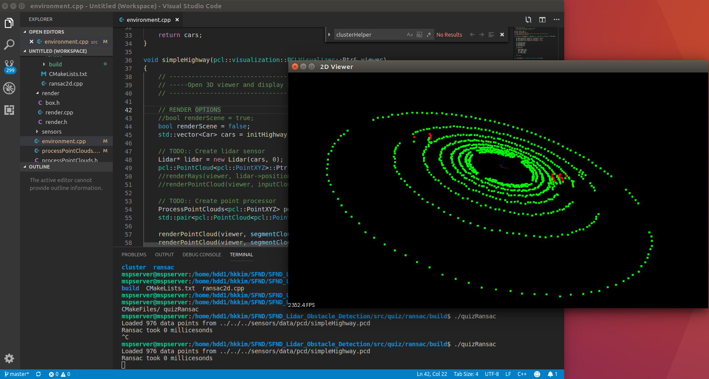
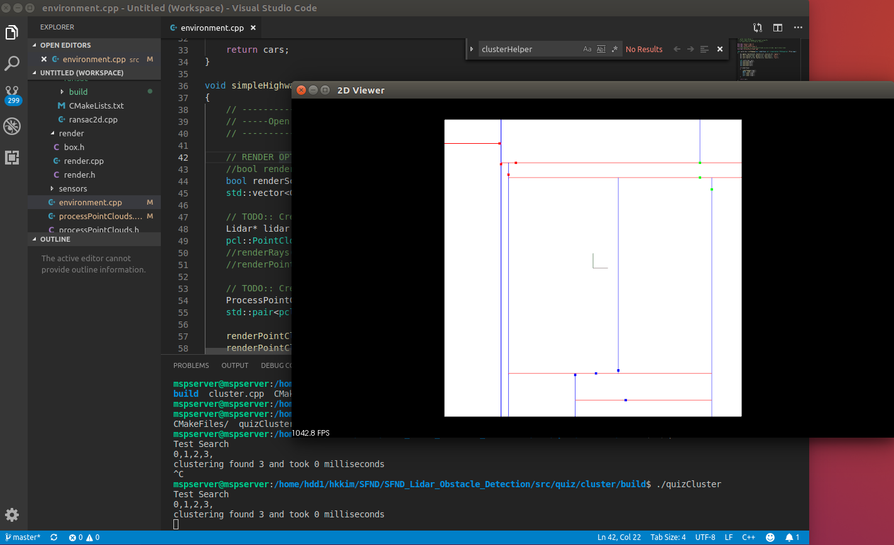
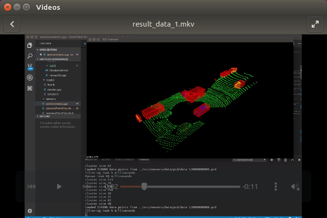
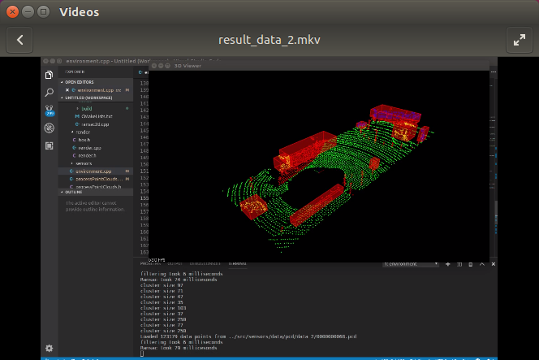

# Sensor Fusion

## Lidar Obstacle Detection 

## 1. Results of Quiz and Project

### 1) Result of Quiz 1 (RANSAC)

### 2) Result of Quiz 2 (Clustering)

### 3) Result of Data1 in the Project 1 (SFND_Lidar_Obstacle_Detection)

<!--

(click on the image to open the video)
-->

### 4) Result of Data2 in the Project 1 (SFND_Lidar_Obstacle_Detection)

<!--

(click on the image to open the video)
-->

## 2. Dev-Env Installation of Quiz and Project

### Installation Instructions

1. Ubuntu [Link](https://askubuntu.com/questions/916260/how-to-install-point-cloud-library-v1-8-pcl-1-8-0-on-ubuntu-16-04-2-lts-for)

2. Windows [Link](http://www.pointclouds.org/downloads/windows.html)

3. MAC [Link](http://www.pointclouds.org/documentation/tutorials/installing_homebrew.php)

### Compilation Instructions

1. `cd src`
2. `mkdir build` & `cd build`
3. `cmake ..`
4. `make`
5. `./environment`

